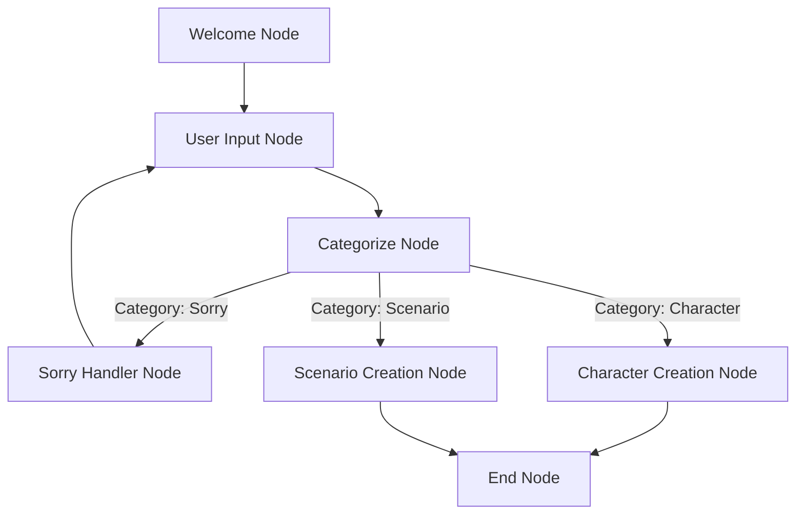

# LangGraph RPG with AWS Bedrock

A creative exploration of LangGraph and AWS Bedrock, built using Cursor IDE. This project demonstrates the power of combining LangGraph's graph-based workflow management with AWS Bedrock's advanced language models to create an interactive experience.

## 🚀 Features

- Integration with AWS Bedrock for advanced language model capabilities
- Graph-based workflow management using LangGraph

## 🛠️ Prerequisites

- Python 3.x
- AWS Account with Bedrock access

## 📦 Installation


1. Install dependencies:
```bash
pip install -r requirements.txt
```

3. Set up your environment variables:
Create a `.env` file in the root directory with your AWS credentials:
```
AWS_ACCESS_KEY_ID=your_access_key
AWS_SECRET_ACCESS_KEY=your_secret_key
AWS_REGION=your_region
```

## 🎮 Usage

Run the main application:
```bash
python main.py
```

The application will initialize with AWS Bedrock and start an interactive session where you can create and manage scenarios/characters/....

## 🏗️ Main Project Structure

```
├── main.py                # Application entry point
├── rpg_graph.py           # Main graph definition and workflow management
├── graph/                 # Graph-related components
│   ├── nodes              # Individual graph nodes
│   └── edges              # Graph edge definitions and routing logic
└── prompts/               # LLM prompt templates
```

### Key Components

- **Graph Components**: The `graph/` directory contains all graph-related code, including node implementations and edge definitions. Each node is a self-contained unit that handles a specific part of the conversation flow.

- **Prompts**: The `prompts/` directory stores all LLM prompt templates, organized by category. These templates are used to generate consistent and high-quality responses from the language model.


## 📊 LangGraph Workflow



## 🤝 Contributing

Feel free to fork this project and experiment with different graph structures or add new features!

## 📝 License

This project is open source and available under the MIT License.

## 🙏 Acknowledgments

- Built with [LangGraph](https://github.com/langchain-ai/langgraph)
- Powered by [AWS Bedrock](https://aws.amazon.com/bedrock/)
- Developed using [Cursor IDE](https://cursor.sh/) 